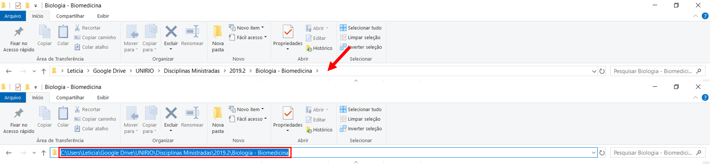

Oi de novo! Antes de iniciarmos o tutorial, vamos deixar instalados alguns pacotes fundamentais para executarmos todas as etapas detalhadas aqui?

Tá, já sei! Não expliquei o que é pacote, não é mesmo?

*Pacotes, também chamados de bibliotecas, são conjuntos de códigos, dados, documentações e testes que visam realizar funções específicas dentro do R. Basicamente, todas as funções que iremos utilizar no R são provenientes de diferentes pacotes.*

Para instalar um pacote, a funcão utilizada é a [`install.packages()`](https://www.rdocumentation.org/packages/utils/versions/3.6.2/topics/install.packages). Basta colocar o nome do pacote dentro da função usando aspas. Por exemplo, `install.packages("carData")`.

Para este tutorial, vamos precisar dos seguintes pacotes: 

* `carData`
* `nycflghts13`
* `dlookr`
* `summarytools`

Vai lá! Abra o seu RStudio e instale os pacotes! Ficarei aqui te esperando!

Agora que você já os instalou, vamos começar?!

# Diretório 

Sempre que vamos iniciar um trabalho, é recomendado criarmos uma pasta em algum local do nosso computador para que os arquivos relacionados sejam armazenados. Trabalhar no R funciona da mesma forma. Esse local é o que chamamos de diretório. 

O R sempre inicia com um diretório definido. Para saber se o diretório corresponde à pasta na qual você deseja armazenar seu trabalho, utilize a função [`getwd()`](https://www.rdocumentation.org/packages/base/versions/3.6.2/topics/getwd). Ela informa o caminho completo do diretório atual. 

<i class="fas fa-pen"></i>

Hora de Praticar!

Sabendo disso, vamos verificar qual o diretório atual? Utilize o espaço abaixo digitando a função recém aprendida. Para visualizar se a resposta está correta, clique no botão `Submit Answer`.

<!---LEARNR EX 1-->

<iframe class="interactive" id="myIframe1" src="https://raposo.shinyapps.io/diretorio/" scrolling="no" frameborder="no"></iframe>

<!------------->

Agora que você já sabe ver o diretório atual, que tal o modificarmos colocando o caminho da nossa pasta de trabalho? 
Vá até a sua pasta de interesse. Em seguida, basta clicar na janela da mesma forma como é feito no exemplo abaixo. O computador irá fornecer o caminho da pasta.

Infelizmente, o R só aceita as barras nos seguintes formatos: `\\` ou `/`. A decisão é sua! Mude a direção da barra ou acrescente mais uma em cada parte do caminho.
No meu caso, o caminho ficou: `C:\\Users\\Leticia\\Google Drive\\UNIRIO\\Disciplinas Ministradas\\2019.2\\Biologia - Biomedicina`

Agora que temos o caminho da pasta que desejamos tornar o diretório, iremos utilizar a função [`setwd()`](https://www.rdocumentation.org/packages/base/versions/3.6.2/topics/getwd). 
O caminho é colocado dentro da função usando aspas no início e no final.
No código abaixo está a mudança para o meu diretório. 

<i class="fas fa-pen"></i>

Hora de Praticar!

Aproveite o código e mude agora o seu diretório para a pasta desejada. Basta substituir o caminho abaixo. Feito isso, clique no botão `Run Code`. Se não aparecer nenhuma mensagem de erro, a mudança foi realizada com sucesso. <i class="fas fa-thumbs-up"></i>

